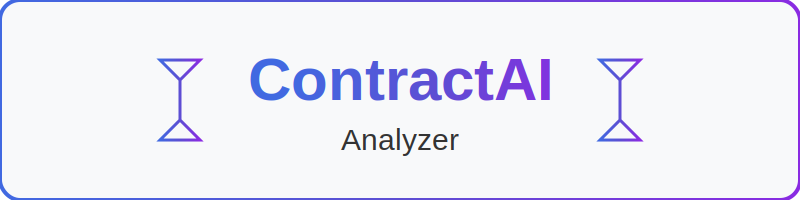

# ContractAI Analyzer

<div id="top">

<p align="center">
  
</p>

<p align="center">
  <em>AI-powered contract analysis for legal professionals and businesses.</em>
</p>

<p align="center">
  
  
  
  
</p>

</div>

<p align="center">
  
</p>

## 📋 Quick Links

- [Introduction](#introduction)
- [Features](#features)
- [Project Structure](#project-structure)
- [Getting Started](#getting-started)
- [Usage](#usage)
- [Docker Support](#docker-support)
- [Development](#development)
- [License](#license)

<p align="center">
  
</p>

## 🚀 Introduction

ContractAI Analyzer is a powerful tool for analyzing legal contracts using AI. It extracts key information, identifies potential risks, and provides a comprehensive analysis of legal documents. The tool is designed to help legal professionals and businesses quickly understand complex contracts, identify important clauses, and make informed decisions.

**Why Use ContractAI Analyzer?**

- **🔍 Automated Analysis**: Extract key terms, obligations, and potential risks from contracts automatically.
- **📊 Comprehensive Reports**: Generate detailed reports in multiple formats (HTML, JSON, Markdown).
- **🔄 OCR Support**: Process scanned documents with Optical Character Recognition.
- **🛠️ Flexible Deployment**: Run locally, via command line, or using Docker.
- **🔒 Privacy-Focused**: Your contracts are processed securely with your own API keys.

## ✨ Features

| Feature | Description |
|---------|-------------|
| **PDF Processing** | Extract text from PDF contracts, including support for OCR on scanned documents |
| **AI-Powered Analysis** | Leverage Mistral AI to analyze contract terms and conditions |
| **Risk Identification** | Automatically identify potential risks and issues in contracts |
| **Summary Generation** | Create concise summaries of lengthy legal documents |
| **Export Options** | Generate reports in multiple formats (JSON, Markdown, HTML) |
| **Docker Support** | Run the analyzer in a containerized environment for easy deployment |
| **Make Integration** | Simplified commands through Makefile for common operations |
| **Modular Architecture** | Well-organized codebase for easy maintenance and extension |

## 📂 Project Structure

```
contractai-analyzer/
├── analyze.py              # Main entry point script
├── Makefile                # Simplifies common commands
├── README.md               # Project documentation
├── requirements.txt        # Python dependencies
├── uv.lock                 # Locked dependencies (for reproducible builds)
├── .env.example            # Example environment variables
├── Dockerfile              # For containerized execution
├── docker-compose.yml      # Docker Compose configuration
├── data/                   # Output directory for analysis results
├── docs/                   # Documentation files
│   └── assets/             # Project assets (logos, images)
├── examples/               # Example contracts for testing
├── scripts/                # Utility scripts
│   ├── setup.sh            # Environment setup script
│   ├── analyze_contract.sh # Legacy script for contract analysis
│   ├── generate_lock.py    # Script to generate dependency lock file
│   └── simple_run.py       # Simple script to run the analyzer
└── src/                    # Source code
    └── contract_analyzer/  # Main package
```

## 🔧 Getting Started

### Prerequisites

- Python 3.9 or higher
- pip (Python package manager)
- Poppler (for PDF processing)
- Tesseract (for OCR capabilities)
- Mistral AI API key

### Environment Setup

There are multiple ways to set up and run the ContractAI Analyzer:

#### Option 1: Using Make (Simplest)

The project includes a Makefile to simplify common tasks:

```bash
# Setup the environment (creates virtual env and installs dependencies)
make setup

# Run the analyzer on an example contract
make run

# Analyze a specific contract with OCR
make analyze PDF=path/to/your/contract.pdf OCR=true
```

#### Option 2: Using Docker

If you prefer using Docker, you can build and run the analyzer in a container:

```bash
# Using Docker Compose (recommended)
docker-compose up

# Or directly with Docker
docker build -t contractai .
docker run -v ./examples:/app/examples -v ./data:/app/data -e MISTRAL_API_KEY=$MISTRAL_API_KEY contractai examples/sample_contract.pdf --ocr
```

#### Option 3: Direct Script Execution

If you prefer to run the scripts directly:

1. Run the setup script to create a virtual environment and install dependencies:

```bash
# Make the script executable
chmod +x scripts/setup.sh

# Run the setup script
./scripts/setup.sh
```

2. Create a `.env` file with your API keys (you can copy from `.env.example`):

```bash
cp .env.example .env
```

3. Edit the `.env` file to add your Mistral AI API key:

```
MISTRAL_API_KEY=your_api_key_here
```

## 📝 Usage

### Analyzing a Contract

To analyze a contract, use the `analyze.py` script:

```bash
# Basic usage
python analyze.py path/to/contract.pdf

# With OCR for scanned documents
python analyze.py path/to/contract.pdf --ocr

# Specify output directory
python analyze.py path/to/contract.pdf --output-dir ./results
```

### Example

```bash
# Analyze a sample contract
python analyze.py examples/sample_contract.pdf
```

## 🐳 Docker Support

The project includes Docker support for easy deployment and execution:

- `Dockerfile`: Defines the container image with all necessary dependencies
- `docker-compose.yml`: Configures the service with volume mappings for examples and data

The Docker setup maps:
- `./examples` to `/app/examples` in the container
- `./data` to `/app/data` in the container

It also passes your Mistral AI key from the environment to the container.

## 👨‍💻 Development

### Dependency Management

The project uses `uv.lock` for locked dependencies to ensure consistent installations. To update the lock file:

```bash
python scripts/generate_lock.py
```

### Adding New Features

1. Add new modules to the `src/contract_analyzer` package
2. Update the main `analyze.py` script to include your new functionality
3. Add tests for your new features
4. Update documentation as needed

## 📄 License

This project is licensed under the MIT License - see the LICENSE file for details.

<div align="left">

[](#top)

</div>

<p align="center">
  
</p>